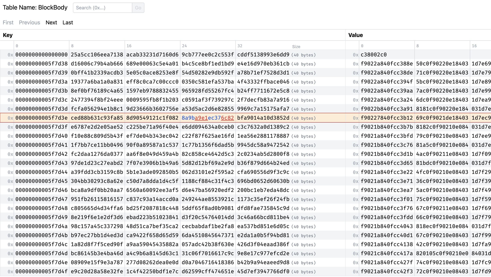

# MDBX Navigator

This is an UI for the KV database [libmdbx](https://github.com/erthink/libmdbx).



The goal is to provide a simple UI for browsing the DB contents, like similar tools that exist for full SQL databases.

## Install

This software is split into 2 parts:

- a backend which reads the DB from the local filesystem and exposes the raw data through a set of REST APIs.
- an UI that consumes those APIs and allows read-only interactions using a regular web browser.
  - The UI is now embedded and served from the backend binary, but it can be run separately during development.

### Build

Make sure you have installed:

- Go toolchain + goreleaser
- [nvm](https://github.com/nvm-sh/nvm)

Once `nvm` is installed, inside the `web` directory, run:

```shell
nvm install
```

This will install and select the proper `nodejs` version.

Now build the go binary for your platform/architecture by running at the root of this repo:

```shell
goreleaser build --snapshot --clean --single-target
```

The binary will be available at `./dist/mdbx-navigator_<architecture>` dir.

From inside that directory, run:

```shell
./mdbx-navigator --data <path-to-your-mdbx.dat-file>
```

It will open the database as read-only in exclusive mode. The frontend will be available at `http://127.0.0.1:56516`.

> No special reason to open it in exclusive mode, I just found it more practical to ensure I don't have to deal with concurrent modifications.

### Trying it

If everything is correct, opening that URL in your preferred browser should display an initial page listing all the tables contained inside the informed mdbx database.
